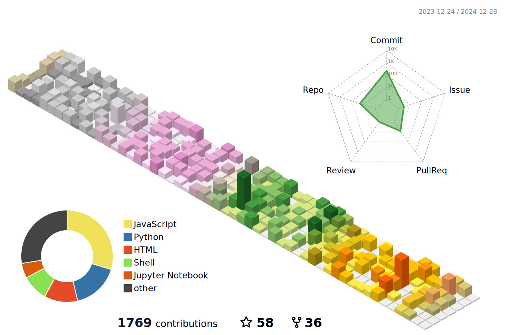

<h1 align="center"></h1>

  

<h3 align="center">Data isn’t just numbers – it’s the roadmap to retail success!</h3>

  

🔭 IT professional with over 13 years of experience in the retail domain, specializing in leading transformative projects to modernize core business applications for retailers.

👨‍💻 Currently working as a Senior Consultant at Deloitte Consulting LLP, leading the transformation of retail applications for the largest supermarket operator in the United States.

🤝 Helping retailers streamline their core business processes focusing on merchadising, purchasing, inventory management, trade management, sales audit, finance & accounting.

👨‍💻 My expertise includes data analytics, business intelligence, and digital transformation, helping retailers leverage technology to drive growth and enhance the customer experience.

🌱 I’m a passionate advocate for data-driven decision-making and business optimization in the retail sector.

💬 Ask me about Retail Business Transformation, Data Analytics, AI/ML in Retail, E-commerce technologies, Cloud Computing.

📫 Reach me @ mayank6031@gmail.com, @ LinkedIn : https://www.linkedin.com/in/mayank-dwivedi-27a52830/

⚡ Fun fact I’m an avid tech enthusiast and always exploring the latest trends in retail innovation.

  

  

<h3 align="left">Connect with me:</h3>

<h3 align="left">Languages and Tools:</h3>

                </a>  

 

&nbsp;

### 🔝 Top Contributed Repo

<h3 align="left">Time spent on my page:</h3>

